<div align="center">



<a href="https://drdo.res.in/WICOMM2026/"></a>


<a href="LICENSE"></a>

</div>

---

Hybrid architectures for automatic modulation classification cascade a convolutional
feature extractor into a variational quantum circuit that acts as the classifier head.
The gains reported for them are measured against non-hybrid or differently sized
classical models, so the contribution of the quantum component alone has never been
isolated. This repository holds the control that isolates it: one extractor, trained
once and frozen, feeding three interchangeable heads.

The quantum head did not win under any configuration we tested. Everything needed to
check that is here.

## Check the central claim in about a second

No dataset, no GPU, no model loading:

```bash
pip install -r requirements.txt
python src/omnibus_test.py
```

```
per-budget paired differences (quantum - classical), S = 8 seeds:
  K= 1  d=-0.0367  t=-1.578  p=0.1585
  K= 5  d=-0.0262  t=-9.779  p=0.0000
  K=10  d=-0.0140  t=-2.472  p=0.0427
  K=20  d=-0.0096  t=-1.785  p=0.1174

omnibus: seed-level mean d=-0.0217, t(7)=-3.247, p=0.0141 (two-sided);
signed-rank p=0.0039; Hotelling F(4,4)=42.76, p=0.0015;
sign test 25/32 negative, p=0.0011
```

Two of the four per-budget tests are inconclusive on their own at eight seeds. Because
the four budgets share seeds they are not mutually independent, so the aggregate forms
are the operative statement. All four aggregates agree, and every seed-level mean is
negative.

## What the comparison controls for

<div align="center">

</div>

Angle embedding rotates one qubit per input value, so a circuit on `n` qubits accepts
exactly `n` inputs and the aperture is pinned at `d = n = 6`. Every head reads the same
six numbers under the same optimiser, the same budget and the same draws. A
1-nearest-neighbour rule with no trainable parameters is included as the admissibility
threshold any trained head has to clear.

## What came out

<div align="center">

</div>

Removing each quantum-specific handicap in turn improves accuracy monotonically, and the
sequence stops at classical parity without crossing it:

| configuration | quantum | matched classical | difference |
| :--- | ---: | ---: | ---: |
| quantum reservoir, 48-dim readout | 0.463 | 0.676 | −0.213 |
| learned embedding | 0.475 | 0.484 | −0.009 |
| cumulant embedding | 0.602 | 0.676 | −0.074 |
| with 27 extended observables | 0.636 | 0.676 | −0.040 |
| quantum kernel SVM | 0.670 | 0.676 | −0.006 |

Accuracy at `K = 20` on four held-out modulation classes. A CNN reading raw I/Q, which is
not subject to the six-value aperture, reaches 0.744 on the same classes.

Two results constrain how far the head can matter at all. Five classifier families given
the complete training set on the same embedding agree to within 0.013, so the heads are
competing over a margin the representation has already bounded. And the quantum head
carries 49 times fewer parameters than the MLP it loses to, so parameter efficiency is
not available as a defence.

## What is in here

| path | contents |
| :--- | :--- |
| `src/omnibus_test.py` | Reproduces every statistic in Section V-A from saved results |
| `src/pipeline.py` | End to end: extractor pretraining, head training, evaluation |
| `src/generate_figures.py` | Regenerates the paper figures |
| `src/e3_radioml2018a.py` | Encoding-scale probe on RadioML 2018.01A |
| `src/reviewer_experiments.py` | Qubit-count scaling at n = 6, 8, 10, 12, and a second backbone |
| `src/make_assets.py` | Regenerates the graphics on this page |
| `notebooks/main_experiments.ipynb` | The runs behind the tables and figures |
| `notebooks/exploration.ipynb` | Earlier exploratory work, kept for provenance |
| `results/*.pkl` | Per-seed accuracies and paired differences, every configuration |
| `results/meta_summary.json` | Class split, qubit count, layer count, headline accuracies |
| `checkpoints/*.pt` | The frozen extractors |

## Configuration

Every number in the paper comes from the configuration recorded in
`results/meta_summary.json`.

- **Circuit** — 6 qubits, 4 data re-uploading layers, 72 trainable weights, simulated
  exactly in PennyLane. Simulation is noiseless, so the quantum model is evaluated under
  the most favourable physical conditions attainable.
- **Seeds** — 0 to 7 for the few-shot experiments, 0 to 4 for the frozen-gate sweep.
- **Held-out classes** — QAM16, QAM64, 8PSK and AM-DSB, the four most confusable, never
  seen during extractor pretraining.
- **Splits** — stratified 60/20/20, each example L2 normalised so the model reads
  waveform geometry rather than amplitude.

## Getting the data

The RadioML corpora are not redistributed here. Request them from
[DeepSig](https://www.deepsig.ai/datasets/). Place `RML2016.10a_dict.pkl` at the
repository root, or point `pipeline.py` at your own copy.

> [!WARNING]
> **The class ordering shipped in the original 2018.01A release is permuted.** Index 0 is
> `32PSK`, not `OOK`. Use `classes-fixed.json` from the Kaggle mirror
> (`pinxau1000/radioml2018`). With the original ordering the held-out set silently
> becomes a different set of modulations, and every downstream number looks entirely
> reasonable while meaning nothing. We confirmed the corrected ordering independently
> from envelope statistics at +30 dB.

<details>
<summary><b>Reproducing a specific result</b></summary>

<br>

| result | how |
| :--- | :--- |
| Section V-A statistics | `python src/omnibus_test.py` — uses `results/results_1c_hard.pkl` |
| Few-shot curves | `notebooks/main_experiments.ipynb`, cells 1b and 1c |
| Representation ceiling | `results/results_1e_ceiling.pkl`, five families on one embedding |
| Frozen-gate sweep | `results/results_1d_frozen.pkl`, K' in {3, 12, 72} |
| Figures | `python src/generate_figures.py` |
| Encoding-scale result | `python src/e3_radioml2018a.py` — needs 2018.01A |
| Page graphics | `python src/make_assets.py` |

The pickles are self-contained. Anything reading only `results/` runs without the
datasets or a GPU.

</details>

<details>
<summary><b>What is not here, and why</b></summary>

<br>

Results are reported for one qubit count, one extractor family and one benchmark. Each is
a live axis rather than a settled one, and `src/reviewer_experiments.py` contains runnable
code for two of them — qubit-count scaling and a second backbone — written so a negative
outcome is as informative as a positive one.

A transmission-coefficient measurement on RadioML 2018.01A was attempted and is **not**
reported. Three of the four SNR bands were degenerate, with accuracies sitting at chance,
which makes the ratio diagnostic inapplicable: the fitted linear coefficient came out
above 1.0, which a linear head cannot achieve against an MLP on the same embedding except
by noise. Only the encoding-scale result from that corpus appears in the paper.

A related prediction was also disconfirmed and is recorded rather than dropped. Saturation
on 2018.01A covers 24% of coordinates against 57–85% on 2016.10a, and a smaller collision
set predicts a higher coefficient. The one healthy band does not support that prediction.

</details>

## Citation

```bibtex
@inproceedings{yashwanth2026qcamc,
  title     = {Isolating the Quantum Contribution in Hybrid Quantum--Classical
               Automatic Modulation Classification: A Matched-Control Study},
  author    = {Yashwanth, M. and Uday Kiran, G. and Veerasekharreddy, B. and
               Srilakshmi, V. and Siddharth, M. and Mounika, M.},
  booktitle = {Proc. IEEE Int. Conf. Wireless Communication for Military
               Applications (WiCOMM)},
  address   = {Dehradun, India},
  year      = {2026}
}
```

## Licence

Code under the MIT Licence, see [`LICENSE`](LICENSE). The RadioML datasets are distributed
by DeepSig under their own terms and are not covered by it.
